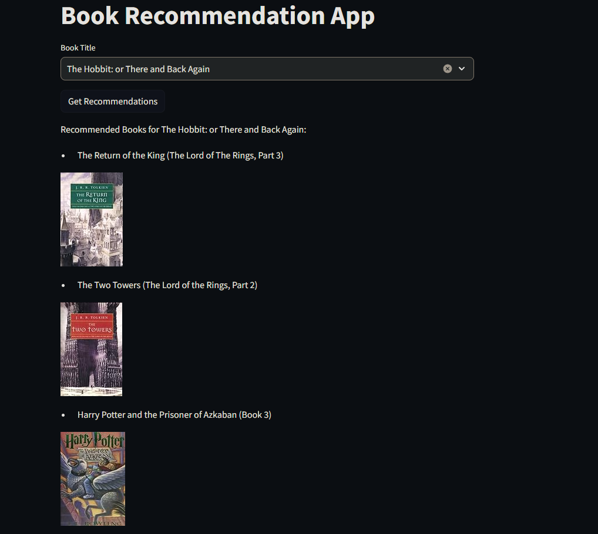

# Book Recommender Project using scikit-surprise 📚✨
This project leverages the power of the scikit-surprise package to provide personalized book recommendations. The dataset used for training and testing the recommendation system is sourced from Kaggle's [Book Recommendation Dataset](https://www.kaggle.com/datasets/arashnic/book-recommendation-dataset). The app can be viewed [here](https://bookrecommenderapp.streamlit.app/).

